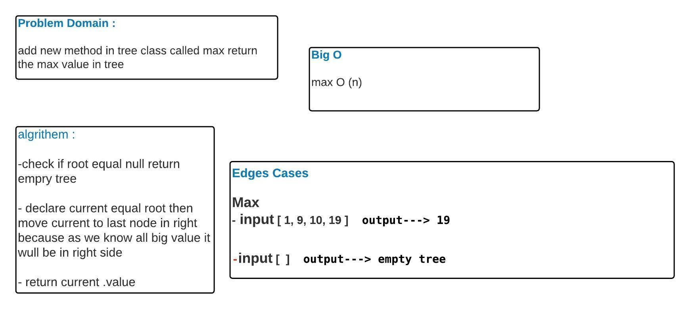

# Tree
<!-- Short summary or background information -->
A tree whose elements have at most 2 children is called a binary tree. Since each element in a binary tree can have only 2 children, we typically name them the left and right child.

## Challenge
<!-- Description of the challenge -->
add new method in tree class called max return the max value in tree
## Approach & Efficiency
<!-- What approach did you take? Why? What is the Big O space/time for this approach? -->
Big O = n 
## Solution
<!-- Embedded whiteboard image -->

