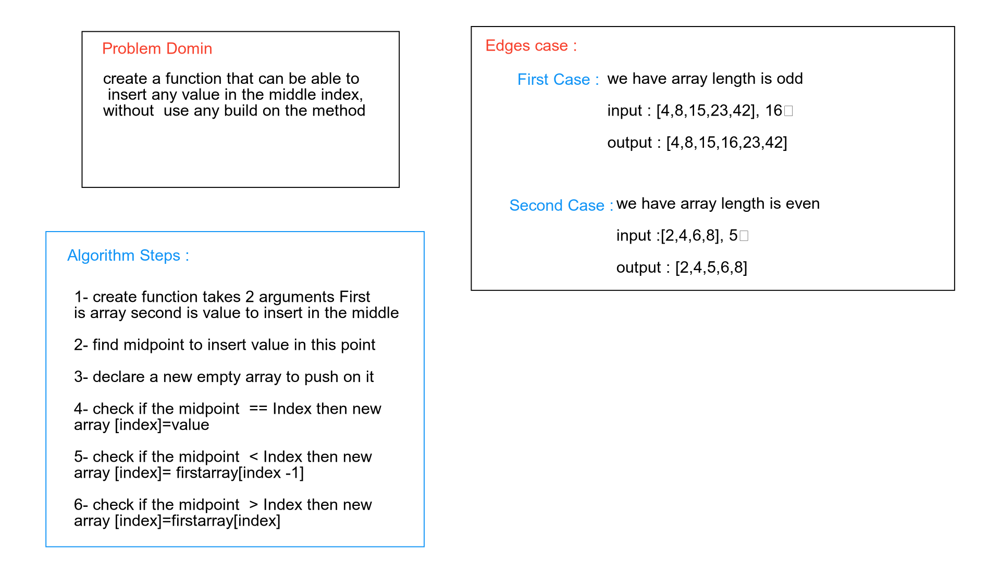

# Shift an Array
<!-- Short summary or background information -->
worked with array array befor and I have bit of how can I deal with that
## Challenge
<!-- Description of the challenge -->
create a function that can be able to
 insert any value in the middle index, 
without  use any build on the method
## Approach & Efficiency
<!-- What approach did you take? Why? What is the Big O space/time for this approach? -->
Big O = n because I used Just for loop
## Solution
<!-- Embedded whiteboard image -->
