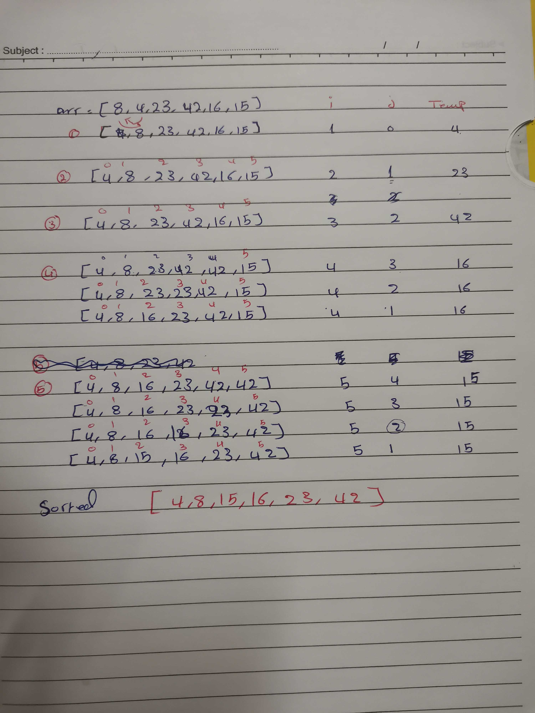

# Shift an Array
<!-- Short summary or background information -->
 then trace the algorithm by stepping through the process with the provided sample array. Document your explanation by creating a blog article that shows the step-by-step output after each iteration through some sort of visual.## Challenge
<!-- Description of the challenge -->
visually show the output of processing this input array:
[8,4,23,42,16,15]
## Approach & Efficiency
<!-- What approach did you take? Why? What is the Big O space/time for this approach? -->
Big O = О(n2)
## Solution
<!-- Embedded whiteboard image -->
