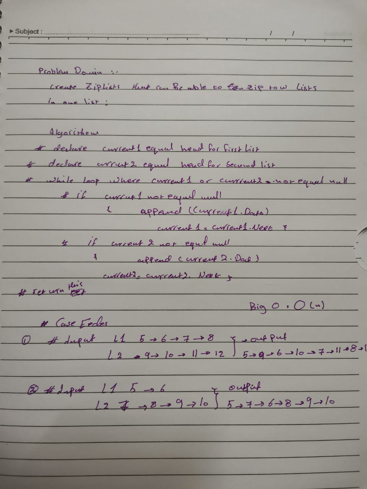
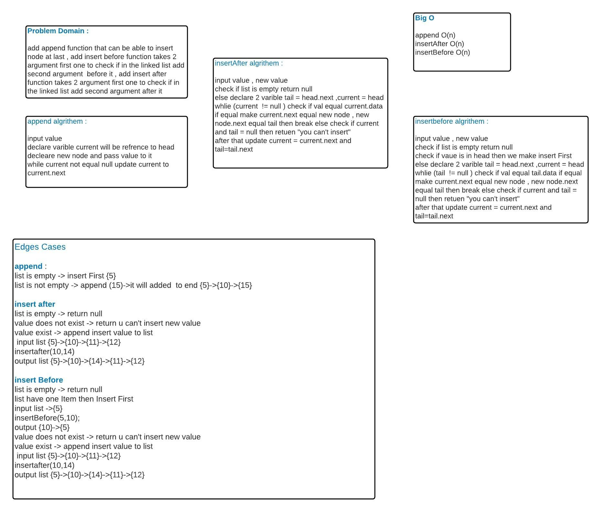
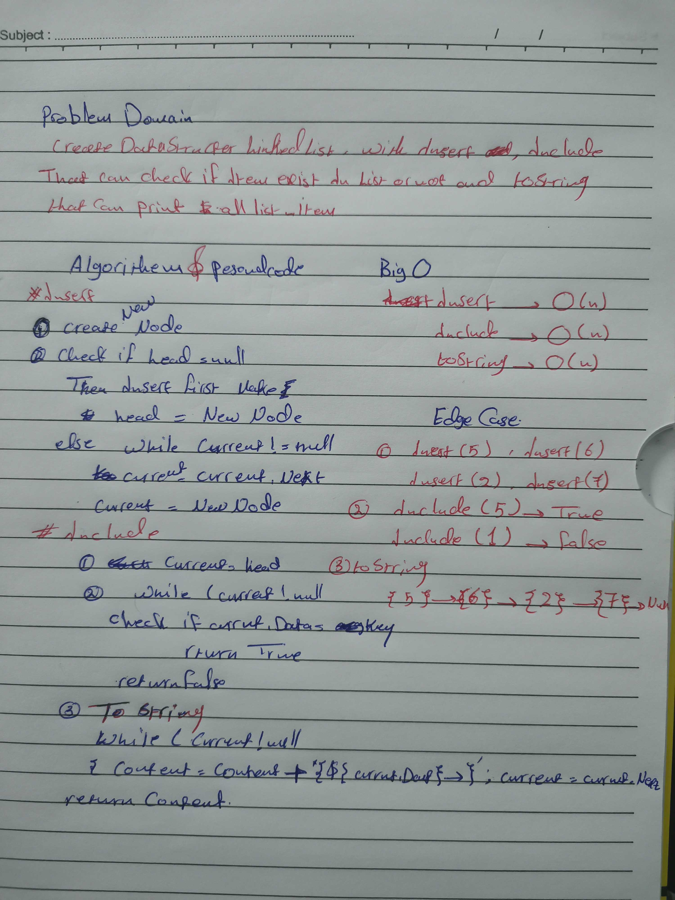

# Linked List Array
<!-- Short summary or background information -->
It's a Data structer to linked multple nodes togather ech node at list have 2 varible one for data other for poniter next

## Challenge
<!-- Description of the challenge -->
create linked list and  a method called  zipLists which takes two linked lists as arguments. Zip the two linked lists together into one so that the nodes alternate between the two lists and return a reference to the head of the zipped list
## Approach & Efficiency
<!-- What approach did you take? Why? What is the Big O space/time for this approach? -->
Big O = n because I used Just for loop
## Solution
<!-- Embedded whiteboard image -->

