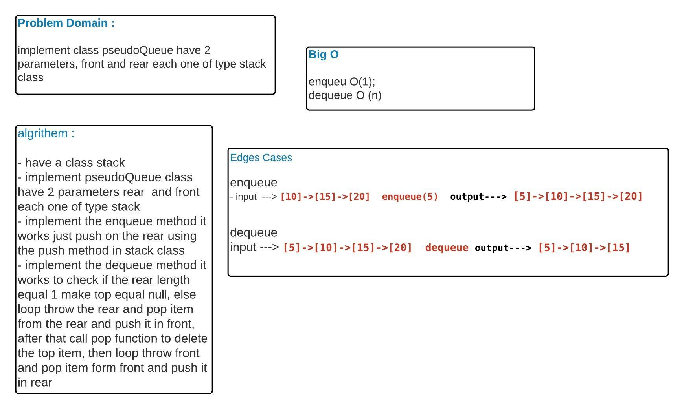

# Stack and Queue 
<!-- Short summary or background information -->
Create a brand new PseudoQueue class,this PseudoQueue class will implement our standard queue interface (the two methods listed below), but will internally only utilize 2 Stack objects
## Challenge
<!-- Description of the challenge -->
 - create your class with the following methods:
enqueue(value) which inserts value into the PseudoQueue, using a first-in, first-out approach.
- dequeue() which extracts a value from the PseudoQueue, using a first-in, first-out approach.
## Approach & Efficiency
<!-- What approach did you take? Why? What is the Big O space/time for this approach? -->
Big O enqueue = O(1)
Big O dequeue = O(n)

## Solution
<!-- Embedded whiteboard image -->
;
