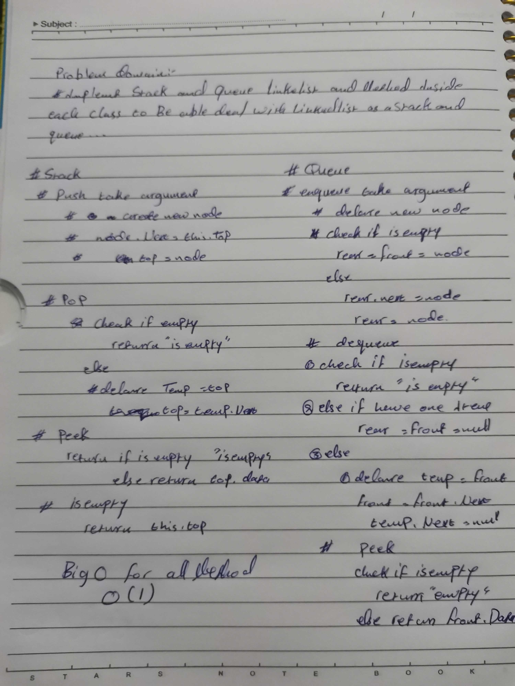

# Stack and Queue 
<!-- Short summary or background information -->
It's a Data structer Queue work First In First Out Stack First In Last Out
## Challenge
<!-- Description of the challenge -->
Implement Linked list using Queue  and Stack  with method to be able to deal with list 
## Approach & Efficiency
<!-- What approach did you take? Why? What is the Big O space/time for this approach? -->
Big O = O(1) for all method
## Solution
<!-- Embedded whiteboard image -->

